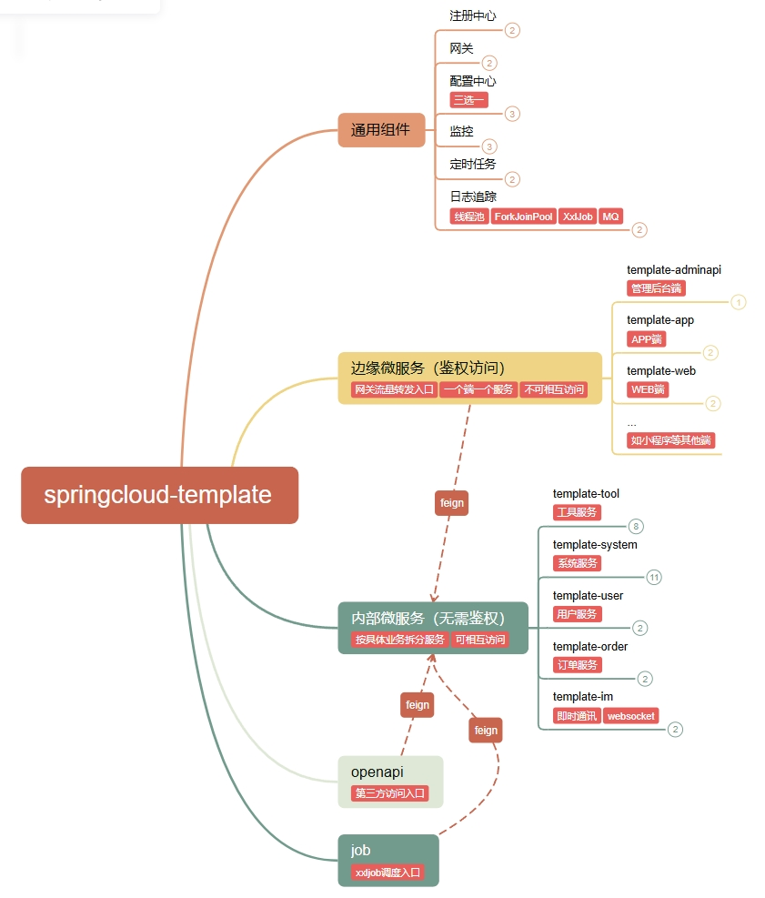
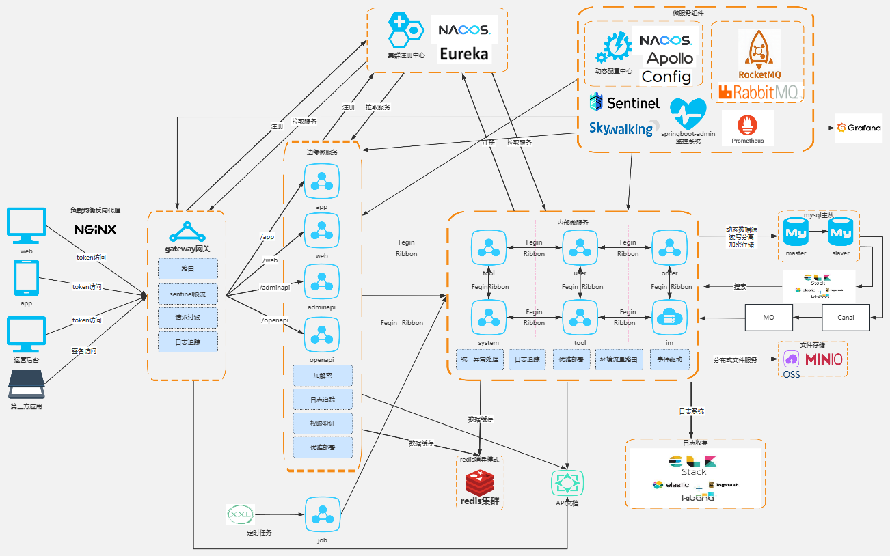

# springcloud-template

## 项目介绍

springcloud-template 是一个企业级的Spring Cloud微服务架构模板，整合了大量常用组件和最佳实践，帮助快速搭建微服务项目。

### 特性

- 基于Eureka服务下线实现无报错优雅发版，优雅关闭应用
- 魔改负载路由，实现环境流量路由到开发本机调试
- 统一异常处理和响应包装
- 请求参数、响应结果统一日志打印(可将日志ID传递至子线程)，skywalking链路追踪
- 自定义线程池日志、Tomcat线程池(主要加了日志打印功能)
- Feign请求头数据在微服务间传递
- 基于MDC实现的自定义请求链路追踪
- 基于redis+注解实现的API幂等
- 配置中心Nacos/Apollo无代码侵入支持@Value动态刷新
- 消息驱动支持RocketMQ/RabbitMQ/SpringEvent一键切换
- 缓存支持Guava/Redis一键切换
- 锁支持ReentrantLock（单机）/Redisson（分布式）一键切换
- 简单登录demo，支持密码、微信、支付宝授权登录等各种登录方式
- 文件存储demo，包括阿里云OSS、腾讯云COS等多种云存储方式，支持客户端上传
- 短信发送demo，支持阿里云、腾讯云等多个渠道，结合MQ实现短信异步发送，并记录短信发送结果
- 验证码发送demo，支持短信、邮件、图形验证码，结合MQ实现短信异步发送，并提供验证码校验API
- ToC优惠券实现demo，能够在不修改表结构的情况增加优惠券使用条件，或者增加复杂度更高的使用条件，具有高扩展性
- ToC弹窗实现demo，能够在不修改表结构的情况增加弹窗条件，或者增加复杂度更高的弹窗条件，具有高扩展性
- 微信订阅消息实现demo，提供存储设计表结构，代码通用，易于使用，易于问题排查
- 动态数据源（主/从读写分离，分库分表）使用demo
- 导航栏金刚位、轮播图实现demo，能够在不修改表结构的情况增加展示条件，或者增加复杂度更高的展示条件，具有高扩展性
- APP版本管理demo，精准把控APP版本发布中的推荐更新、强制更新

## 快速开始

### 核心依赖

| 依赖                  | 版本      |
|----------------------|------------|
| Spring Cloud         | 2021.0.9   |
| Spring Cloud Alibaba | 2021.0.6.2   |
| Spring Boot          | 2.7.18     |
| Eureka               | 跟随Spring Cloud  |
| Nacos                | 跟随Spring Cloud Alibaba  |
| Apollo               | 2.4.0  |
| Gateway              | 跟随Spring Cloud  |
| Open Feign           | 跟随Spring Cloud  |
| Resilience4J         | 跟随Spring Cloud  |
| Sentinel             | 跟随Spring Cloud Alibaba  |
| RocketMQ             | 2.2.3  |
| RabbitMQ             | 跟随Spring Boot |
| Skywalking           | 9.3.0  |
| Prometheus           | 跟随Spring Cloud  |
| Xxl Job              | 2.3.0  |
| Elasticsearch        | 6.1.8  |
| Canal                | 1.2.1-RELEASE  |
| Druid                | 1.2.8   |
| Mybatis Plus         | 3.5.7   |
| Dynamic Datasource   | 3.6.1   |
| Database Encrypt     | 1.0.10  |
| Sa Token             | 1.40.0  |
| Knife4j              | 4.5.0  |
| Redis                | 跟随Spring Boot |
| Redisson             | 3.12.0  |
| Hutool               | 5.8.5  |
| graceful-response    | 5.0.3-boot2  |

### 模块说明

```lua
springcloud-template
├── template-common -- 公共代码(所有模块都依赖它)
└── boot-starter -- starter框架代码
     └── datasource -- 数据源
     └── encryptbody -- 请求/响应加解密
     └── token -- token的使用
          └── JWT
          └── sa-token的应用
└── template-framework -- 框架代码(内部微服务)
     └── autoconfigure -- 自动配置
     └── cache -- 缓存
     └── canal -- 数据变更监听（分享：https://www.toutiao.com/article/7578448808669921838）
     └── config -- 动态刷新配置中心配置（分享：https://www.toutiao.com/article/7258567779102917139）
     └── deploy -- 优雅发版(可做到用户无感发版，完全不报错，分享：https://www.toutiao.com/article/7136601651804127751)
     └── developer -- 环境流量路由到本机，调试神器（分享：https://www.toutiao.com/article/7514716979333268008）
     └── feign -- Feign请求头数据在微服务间传递（分享：https://www.toutiao.com/article/7126056949267268108）
     └── globalresponse -- 统一异常处理、响应日志统一打印（分享：https://www.toutiao.com/article/7588770501573591587）
     └── lock -- 锁设计
     └── message -- 文案国际化
     └── messagedriven -- 消息驱动，实现异步处理生产者
     └── sequence -- 生成唯一ID
     └── threadpool -- 自定义线程池（JDK和Tomcat）
     └── trace -- 日志追踪（分享：https://www.toutiao.com/article/7126056949267268108）
└── template-framework-edge -- 框架代码(边缘微服务)
     └── filter -- http公共请求参数设置到请求头在微服务内传递
     └── globalresponse -- 统一异常处理、响应日志统一打印（分享：https://www.toutiao.com/article/7588770501573591587）
     └── interceptor -- 访问控制(结合@RequireLogin使用)
	 └── jackson -- json响应值自定义序列化
├── template-eureka -- 注册中心
├── template-gateway -- 网关(分享：https://www.toutiao.com/article/7271926711678321215)
├── template-zuul -- 网关（版本升级后已移除）
├── template-config -- 配置中心（建议使用Nacos/Apollo）
└── template-order -- 订单服务(内部微服务)
     └── template-order-api -- 被依赖开放api
     └── template-order-service -- 微服务
└── template-system -- 系统服务(内部微服务)
     └── template-system-api -- 被依赖开放api
     └── template-system-service -- 微服务
└── template-tool -- 工具服务(内部微服务)
     └── template-tool-api -- 被依赖开放api
     └── template-tool-service -- 微服务
          └── controller
               └── FileController -- 文件存储使用demo（支持阿里OSS、腾讯云COS、MinIO、本地磁盘等多种方式）
          └── popup -- 弹窗设计demo（分享：https://www.toutiao.com/article/7287587310307738146）
               └── condition -- 弹窗条件实现类
               └── PopCondition -- 抽象定义弹窗条件
               └── PopService -- 弹窗查询的核心代码
               └── ReplaceParam -- 参数替换接口
          └── sms -- 短信设计demo（分享：https://www.toutiao.com/article/7248173282141291047）
               └── AsyncSmsSender -- 短信发送器（异步）
               └── MysqlSendPostProcessor -- 短信发送记录
               └── SmsSenderConsumer -- 短信发送处理器（消费者逻辑）
          └── subscribe -- 微信订阅消息设计demo
               └── AsyncSubscribeSender -- 订阅消息发送器（异步）
               └── SubscribeSenderConsumer -- 订阅消息发送处理器（消费者逻辑）
└── template-user -- 用户服务(内部微服务)
     └── template-system-api -- 被依赖开放api
     └── template-system-service -- 微服务
          └── canal-- canal使用demo
          └── coupon -- 优惠券设计demo（分享：https://www.toutiao.com/article/7228973418354475572）
               └── UseCouponService -- 优惠券核心类
          └── wallet -- 钱包设计demo
└── template-im -- 即时通讯服务(内部微服务)
     └── template-im-api -- 被依赖开放api
     └── template-im-service -- 微服务
├── template-app -- app端接入层(边缘微服务)
├── template-web -- web端接入层(边缘微服务)
     └── easylogin -- 登录方式（分享：https://www.toutiao.com/article/7144259146018406948）
          └── 本机号码一键登录
          └── 用户名+密码登录
          └── 手机号+验证码登录
          └── 手机号+验证码登录并绑定授权码
          └── APP微信授权登录
          └── 微信小程序登录(新版)
          └── 微信小程序登录(旧版)
          └── 微信公众号登录
          └── 支付宝小程序登录
├── template-admin -- 管理后台端(前后端一体)
├── template-adminapi -- 管理后台端(前后端分离)
├── template-openapi -- 开放平台接入层(边缘微服务)
├── sql -- 项目中的表结构设计
```

### 服务说明

| 服务                | 端口   | 功能说明               |
|-------------------|------|--------------------|
| template-eureka   | 7010 | 注册中心（可替换为nacos） |
| template-gateway  | 7020 | 网关                 |
| template-config   | 7030 | 配置中心（可替换为nacos）    |
| template-monitor  | 7040 | 监控                 |
| template-system   | 8010 | 系统服务               |
| template-tool     | 8020 | 工具服务               |
| template-user     | 8030 | 用户服务               |
| template-order    | 8040 | 订单服务               |
| template-im       | 8050 | 即时通讯服务             |
| template-web      | 9010 | WEB端              |
| template-app      | 9020 | APP端              |
| template-adminapi | 9030 | 管理后台端 |
| template-job      | 9040 | 定时任务               |
| template-openapi  | 9050 | 第三方访问入口          |

#### 端口规范

- 7XX0:公共组件，8XX0:内部微服务，9XX0:边缘微服务
- 最后1位用于同主机扩展多实例，如注册中心集群可使用7011,7012...

[](https://www.processon.com/view/link/68317e34db67fa46d0c8594e?cid=68317cad128c8b0017e8cd56)

### 项目架构

[](https://www.processon.com/view/link/68713ad7c67d8579a95c07d2?cid=686fc6f7352e7c324d1b6bdf)

### 开发与运行

#### 按需执行[sql](sql)脚本

#### 开关配置

| 开关/可选项                                        | 配置                                                                                                 | 说明                                                                                                                                                                                                                                                  |
|-----------------------------------------------------|----------------------------------------------------------------------------------------------------|-----------------------------------------------------------------------------------------------------------------------------------------------------------------------------------------------------------------------------------------------------|
| 注册到eureka注册中心 <br/> 注册到nacos注册中心                    | eureka.client.enabled <br/> spring.cloud.nacos.discovery.enabled                                   | [bootstrap-eureka.yml](framework/src/main/resources/bootstrap-eureka.yml) <br/> [bootstrap-nacos-discovery.yml](framework/src/main/resources/bootstrap-nacos-discovery.yml)                                                                         |
| 注册到apollo配置中心 <br/> 注册到nacos配置中心 <br/> 注册到config配置中心 | apollo.bootstrap.enabled <br/> spring.cloud.nacos.config.enabled <br/> spring.cloud.config.enabled | [bootstrap-apollo.yml](framework/src/main/resources/bootstrap-apollo.yml) <br/> [bootstrap-nacos-config.yml](framework/src/main/resources/bootstrap-nacos-config.yml) <br/> [bootstrap-config.yml](framework/src/main/resources/bootstrap-config.yml) |
| 使用resilience4j熔断器 <br/> 使用sentinel熔断器               | spring.cloud.circuitbreaker.resilience4j.enable <br/> spring.cloud.sentinel.enabled                | [application-resilience4j.yml](framework/src/main/resources/application-resilience4j.yml) <br/> [application-sentinel.yml](framework/src/main/resources/application-sentinel.yml)                                                                   |
| 缓存                                                  | template.enable.cache                                                                              | [application-dev/../prod.yml](user/service/src/main/resources/application-dev.yml) <br/> guava:本地缓存（启动不依赖中间件，建议仅dev使用）<br/> redis:redis缓存（建议使用）<br/> combination:组合缓存（redis挂掉可切换至本地缓存）                                                              |
| 锁                                                   | template.enable.lock                                                                               | [application-dev/../prod.yml](user/service/src/main/resources/application-dev.yml) <br/> jvm:jvm锁（启动不依赖中间件，建议仅dev使用）<br/> redisson:redisson分布式锁（建议使用）                                                                                               |
| 消息驱动                                                | template.enable.message-driven                                                                     | [application-dev/../prod.yml](user/service/src/main/resources/application-dev.yml) <br/> springevent:spring事件（启动不依赖中间件，建议仅dev使用）<br/> rabbitmq:RabbitMQ消息队列（建议使用）<br/> rocketmq:RocketMQ消息队列（建议使用）                                                  |
| 访问控制（仅边缘微服务有）                                       | template.enable.access-control                                                                     | [application-dev/../prod.yml](web/src/main/resources/application-dev.yml)) <br/> true:开启token鉴权 <br/> false:关闭token鉴权 （建议仅dev使用）                                                                                                                    |

#### 快速开始

1. 启动基础服务：
   - 启动注册中心：运行`eureka`模块的`EurekaApplication` 或 外置`nacos`
     - dev环境下默认关闭了注册中心，如开启请修改framework下bootstrap-eureka.yml或bootstrap-nacos-discovery.yml的dev环境配置
      ```yaml
      eureka:
        client:
          enabled: true # Eureka注册中心开关
      # or
      spring:
        cloud:
          nacos:
            discovery:
              enabled: true # nacos注册中心开关
      ```
   - 启动网关：运行[gateway](gateway)模块的`GatewayApplication`
2. 启动业务服务：
   - 根据需要启动相应的业务服务，如[app](app)、[system](system)、[user](user)等
3. 访问服务：
   - Eureka控制台：http://localhost:7010
   - API文档（基于gateway）：http://localhost:7020/doc.html

#### Docker部署

详细说明请参考 [docker/README.md](docker/README.md)

1. 构建基础镜像：
   ```bash
   cd docker
   docker build -t springcloud-template/base-image:v1 .
   ```
   
2. 构建并启动各服务：
   - 构建eureka服务
   ```bash
    cd ../eureka
    docker build -t template-eureka .
    docker run -d -it -p 7010:7010 -v D:/logs/template-eureka:/logs --name template-eureka template-eureka
   ```
   - 构建web服务
   ```bash
    cd ../web
    docker build -t template-web .
    docker run -d -it -p 9010:9010 -v D:/logs/template-web:/logs --name template-web template-web
   ```
   - 构建其他服务类似...

## 开源共建

### 开源协议

springcloud-template 开源软件遵循 [Apache 2.0 协议](https://www.apache.org/licenses/LICENSE-2.0.html)。
允许商业使用，但务必保留类作者、Copyright 信息。

### 其他说明
1. 联系作者 <a href="mailto:897665787@qq.com">897665787@qq.com</a>

### 感谢
 - nacos: https://nacos.io/
 - 登录认证：https://gitee.com/jq_di/easy-login
 - Sa-Token：https://sa-token.cc
 - 文件存储：https://gitee.com/jq_di/file-storage
 - 短信发送：https://gitee.com/jq_di/sms-sender
 - Knife4j API文档：https://doc.xiaominfo.com
 - 动态数据源：https://gitee.com/baomidou/dynamic-datasource-spring-boot-starter
 - XXL-JOB：https://gitee.com/xuxueli0323/xxl-job
https://gitee.com/ilusymon/auth-server.git
