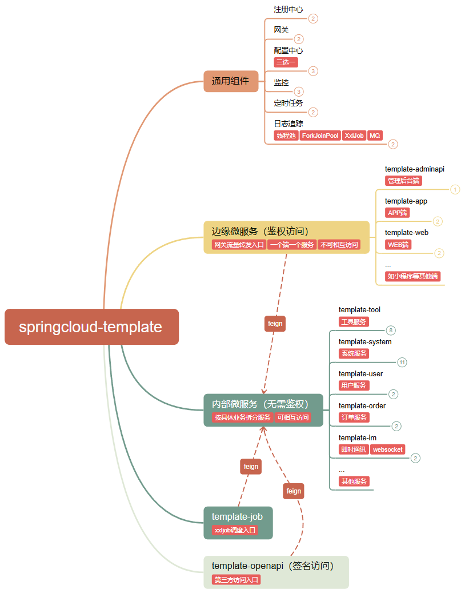

一个基于 Spring Cloud Netflix 的微服务开发脚手架，记录了各种基础、通用功能的最佳实践。

## 功能说明
- 基于Eureka服务下线实现无报错优雅发版，优雅关闭应用
- 魔改负载路由，实现环境流量路由到开发本机调试
- 统一异常处理和响应包装
- 请求参数、响应结果统一日志打印(可将日志ID传递至子线程)，skywalking链路追踪
- 自定义线程池日志、Tomcat线程池(主要加了日志打印功能)
- Feign请求头数据在微服务间传递
- 基于MDC实现的自定义请求链路追踪
- 基于redis+注解实现的API幂等
- 配置中心Nacos/Apollo无代码侵入支持@Value动态刷新
- 消息驱动支持RocketMQ/RabbitMQ/SpringEvent一键切换
- 缓存支持Guava/Redis一键切换
- 锁支持ReentrantLock（单机）/Redisson（分布式）一键切换
- 简单登录demo，支持密码、微信、支付宝授权登录等各种登录方式
- 文件存储demo，包括阿里云OSS、腾讯云COS等多种云存储方式，支持客户端上传
- 短信发送demo，支持阿里云、腾讯云等多个渠道，结合MQ实现短信异步发送，并记录短信发送结果
- 验证码发送demo，支持短信、邮件、图形验证码，结合MQ实现短信异步发送，并提供验证码校验API
- ToC优惠券实现demo，能够在不修改表结构的情况增加优惠券使用条件，或者增加复杂度更高的使用条件，具有高扩展性
- ToC弹窗实现demo，能够在不修改表结构的情况增加弹窗条件，或者增加复杂度更高的弹窗条件，具有高扩展性
- 微信订阅消息实现demo，提供存储设计表结构，代码通用，易于使用，易于问题排查
- 动态数据源（主/从读写分离，分库分表）使用demo
- 导航栏金刚位、轮播图实现demo，能够在不修改表结构的情况增加展示条件，或者增加复杂度更高的展示条件，具有高扩展性
- APP版本管理demo，精准把控APP版本发布中的推荐更新、强制更新

## 快速开始

### 核心依赖

| 依赖                  | 版本       |
|----------------------|------------|
| Spring Cloud Netflix | 2021.0.9   |
| Spring Boot          | 2.7.18     |
| Mybatis Plus         | 3.5.7   |
| RocketMQ             | 2.2.3  |

### 模块说明

```lua
springcloud-template
├── template-common -- 公共模块
└── template-framework -- 框架代码(内部微服务)
     └── advice -- 统一异常处理、响应日志统一打印
     └── apollo -- apollo属性刷新配置（分享：https://www.toutiao.com/article/7258567779102917139）
     └── autoconfigure -- 自动配置
     └── deploy -- 优雅发版(可做到用户无感发版，完全不报错，分享：https://www.toutiao.com/article/7136601651804127751)
     └── developer -- 环境流量路由到本机，调试神器（分享：https://www.toutiao.com/article/7514716979333268008）
     └── interceptor -- Feign请求头数据在微服务间传递（分享：https://www.toutiao.com/article/7126056949267268108）
     └── threadpool -- 自定义线程池（JDK和Tomcat）
└── template-framework-edge -- 框架代码(边缘微服务)
     └── filter -- http公共请求参数设置到请求头在微服务内传递
     └── interceptor -- 访问控制(结合@RequireLogin使用)
├── template-eureka -- 注册中心
├── template-gateway -- 网关(分享：https://www.toutiao.com/article/7271926711678321215)
├── template-zuul -- 网关（版本升级后已移除）
├── template-config -- 配置中心（建议使用Nacos/Apollo）
└── template-order -- 订单服务(内部微服务)
     └── template-order-api -- 被依赖开放api
└── template-order -- 订单服务(内部微服务)
     └── template-order-api -- 被依赖开放api
└── template-system -- 系统服务(内部微服务)
     └── template-system-api -- 被依赖开放api
└── template-tool -- 工具服务(内部微服务)
     └── template-tool-api -- 被依赖开放api
     └── controller
          └── FileController -- 文件存储使用demo（支持阿里OSS、腾讯云COS、MinIO、本地磁盘等多种方式）
     └── popup -- 弹窗设计demo（分享：https://www.toutiao.com/article/7287587310307738146）
          └── condition -- 弹窗条件实现类
          └── PopCondition -- 抽象定义弹窗条件
          └── PopService -- 弹窗查询的核心代码
          └── ReplaceParam -- 参数替换接口
     └── sms -- 短信设计demo（分享：https://www.toutiao.com/article/7248173282141291047）
          └── AsyncSmsSender -- 短信发送器（异步）
          └── MysqlSendPostProcessor -- 短信发送记录
          └── SmsSenderConsumer -- 短信发送处理器（消费者逻辑）
     └── subscribe -- 微信订阅消息设计demo
          └── AsyncSubscribeSender -- 订阅消息发送器（异步）
          └── SubscribeSenderConsumer -- 订阅消息发送处理器（消费者逻辑）
└── template-user -- 用户服务(内部微服务)
     └── canal-- canal使用demo
     └── coupon -- 优惠券设计demo（分享：https://www.toutiao.com/article/7228973418354475572）
          └── UseCouponService -- 优惠券核心类
     └── wallet -- 钱包设计demo
├── template-app -- app端接入层(边缘微服务)
├── template-web -- web端接入层(边缘微服务)
     └── easylogin -- 登录方式（分享：https://www.toutiao.com/article/7144259146018406948）
          └── 本机号码一键登录
          └── 用户名+密码登录
          └── 手机号+验证码登录
          └── 手机号+验证码登录并绑定授权码
          └── APP微信授权登录
          └── 微信小程序登录(新版)
          └── 微信小程序登录(旧版)
          └── 微信公众号登录
          └── 支付宝小程序登录
     └── token -- token的使用
          └── JWT
          └── sa-token的应用
├── template-admin -- 管理后台端(前后端一体)
├── template-adminapi -- 管理后台端(前后端分离)
├── sql -- 项目中的表结构设计
```

### 服务说明

| 服务                | 端口   | 功能说明               |
|-------------------|------|--------------------|
| template-eureka   | 7001 | 注册中心（可替换为nacos） |
| template-gateway  | 5001 | 网关                 |
| template-config   | 4001 | 配置中心（可替换为nacos）    |
| template-monitor  | 3001 | 监控                 |
| template-system   | 8003 | 系统服务               |
| template-tool     | 4001 | 工具服务               |
| template-user     | 8002 | 用户服务               |
| template-order    | 8001 | 订单服务               |
| template-im       | 8004 | 即时通讯服务             |
| template-web      | 6001 | WEB端              |
| template-app      | 6101 | APP端              |
| template-openapi  | 6201 | 第三方访问入口          |
| template-job      | 7002 | 定时任务               |
| template-adminapi | 5001 | 管理后台端 |

[详细请查看ProcessOn图表](https://www.processon.com/view/link/68317e34db67fa46d0c8594e?cid=68317cad128c8b0017e8cd56)

[](https://www.processon.com/view/link/68317e34db67fa46d0c8594e?cid=68317cad128c8b0017e8cd56)


### 本地开发 运行

- dev环境下默认关闭了注册中心，如开启请修改framework下bootstrap-eureka.yml或bootstrap-nacos-discovery.yml的dev环境配置
```yaml
eureka:
  client:
    enabled: true # Eureka注册中心开关
# or
spring:
  cloud:
    nacos:
      discovery:
        enabled: true # nacos注册中心开关
```

- 每个微服务都可以单独启动、单独调试（如果需要预览API内没有依赖内部微服务，也可不启动），就可以请求相关API进行效果预览了（建议使用postman等工具）

### 运用

- 建议作为参考demo，再结合你的项目选择合适代码放到你的项目中


## 开源共建

### 开源协议

springcloud-template 开源软件遵循 [Apache 2.0 协议](https://www.apache.org/licenses/LICENSE-2.0.html)。
允许商业使用，但务必保留类作者、Copyright 信息。

### 其他说明

1. 联系作者 <a href="mailto:897665787@qq.com">897665787@qq.com</a>
